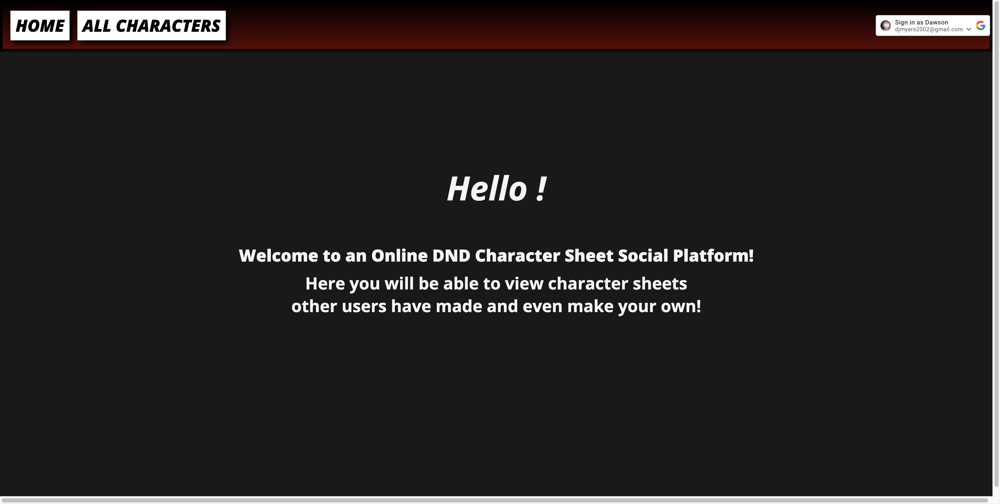

# DND Social

I always found the idea of seeing other people's DND characters very interesting. Especially if you happen to listen to a DND podcast and want to follow along. DND Social pokes at that possibility.

## Description

DND Social is an incrediably simple social platform that allows you to view other people's DND character sheets.

## Getting Started

### Requirements

* Google Account

### 🐉 [LINK](https://dnd-social.fly.dev/) 🐉
### 🖥 [TRELLO](https://dnd-social.fly.dev/) 🖥

### How To Play

* Click Here [LINK](https://dnd-social.fly.dev/)
* Sign In Using Google

## Technologies Used

* VS Code
* Git
* HTML
* CSS
* JavaScript

## Future Plans:
 * Query Search 
 * View Only Your Characters
 * Clean UP CSS
