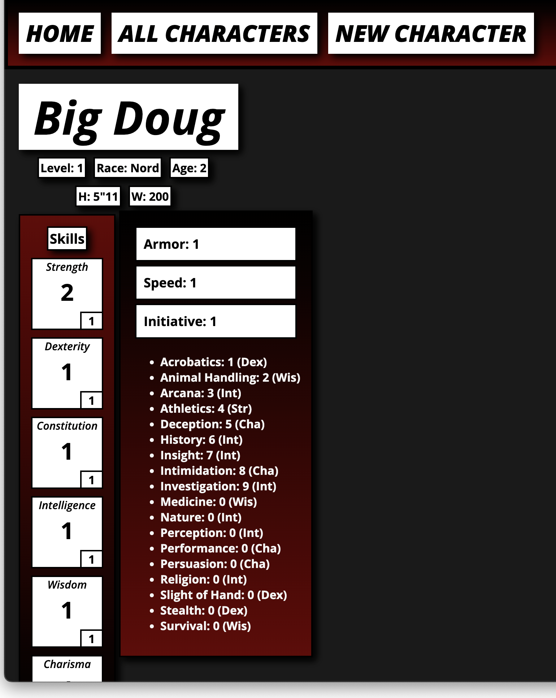

# DND Social

Are you a Dungeons and Dragons enthusiast who loves listening to DND podcasts and following the adventures of other players? Do you find the idea of peeking into other people's DND characters intriguing? If so, you're in luck! DND Social is the perfect platform for you to explore and discover other players' characters.

With DND Social, you can immerse yourself in the world of DND characters, connect with other players, and gain inspiration for your own characters. Our platform is incredibly simple and easy to use, and all you need is a Google account to get started.

The possibilities are endless with DND Social. You can explore a vast array of characters, from wizards and sorcerers to warriors and rogues. You can also discover new character concepts, see how other players build their characters, and even find inspiration for your next campaign.

## Description

Login, Create a Character, Browse!!!

## Getting Started

### Requirements

* Google Account

### 🐉 [LINK](https://dnd-social.fly.dev/) 🐉
### 🖥 [TRELLO](https://trello.com/invite/b/p5Jc1X33/ATTIfcd155b5d6ff0e9e85de6fe1c06efcc774AA5D24/dnd-character-sheet-social-platform) 🖥

### How To Use

* Click Here [LINK](https://dnd-social.fly.dev/)
* Sign In Using Google
* Click Add Character to Create New Character

## Technologies Used

* VS Code
* Git
* HTML
* CSS
* JavaScript
* NodeJs
* MongoDB
* Trello 
* Whimsical
* Google OAuth
* Express
* Mongoose

## Future Plans:
 * Query Search 
 * View Only Your Characters
 * Clean UP CSS
